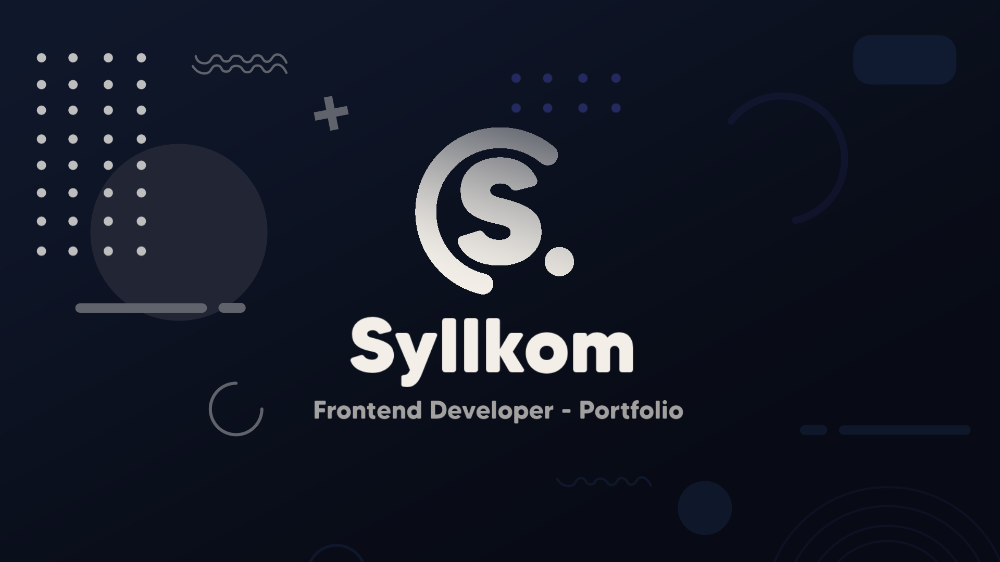

# Modern Portfolio Website Template



## About The Project

This is a modern, responsive, and animated personal portfolio website template designed to showcase your skills, experience, and projects in a professional and engaging manner. It is built with clean HTML, well-structured CSS (featuring CSS Variables for easy theming), and vanilla JavaScript for interactivity. The design prioritizes a sleek dark theme, smooth animations, and a clear user experience.

## Features

- Fully responsive design that adapts to desktops, tablets, and mobile devices.
- Modern dark aesthetic with easily configurable color schemes through CSS variables.
- Smooth scrolling for navigation links.
- On-scroll animations for various elements to enhance user engagement.
- Interactive sections including:
    - Home: Introduction with profile picture and social links.
    - Skills: Display technical abilities with progress bars and descriptions.
    - Experience: A professional timeline to showcase work history.
    - Projects: A filterable gallery for your projects with links to demos and code.
    - Contact: Contact information and a form integrated with WhatsApp for direct messaging.
- Animated background elements for a subtle dynamic feel.
- Mobile-friendly navigation menu that hides on scroll down and reappears on scroll up to save screen space.

## Built With

- HTML5
- CSS3 (Custom Properties / Variables)
- Vanilla JavaScript
- Font Awesome (for icons)
- Google Fonts (Poppins & Space Grotesk)

## Getting Started

To use this template for your own portfolio, follow these steps:

1.  **Clone the repository:**
    ```bash
    git clone https://github.com/Syllkom/Syllkom-ultimate.git
    ```

2.  **Navigate to the project directory:**
    ```bash
    cd Syllkom-ultimate
    ```

3.  **Open `index.html` in your browser:**
    You can simply open the `index.html` file directly in your web browser to view the portfolio.

4.  **Start customizing:**
    Edit the HTML, CSS, and JavaScript files as outlined in the Customization section below.

## Customization

This portfolio is designed to be easily personalized. Here’s a guide to help you:

### 1. Personal Information (`index.html`)

-   **Header & Footer Logo:**
    -   Modify the SVG code or the text "Syllkom" within the `<a>` tag with class `logo` in the `<header class="site-header">` and `<div class="footer-logo">`.
-   **Home Section (id="inicio"):**
    -   Change the main title "Hola, soy Syllkom" and subtitle "Developer Frontend".
    -   Update the introductory paragraph under `class="home-text"`.
    -   Replace the profile picture by changing the `src` of `` to your image file.
    -   Update the `href` attributes for the social media links in `<div class="home-social-links">`.

### 2. Theme and Styling (`./main/css/—style.css`)

-   **Colors:**
    -   The primary color scheme is defined using CSS variables in the `:root` selector at the top of `—style.css`.
    -   Modify variables like `--background`, `--primary-gradient-start`, `--text-white`, etc., to change the overall look and feel.
-   **Fonts:**
    -   The template uses "Poppins" and "Space Grotesk" from Google Fonts.
    -   To change fonts, update the `@import` URLs at the beginning of `—style.css` and modify the `--font-primary` and `--font-secondary` CSS variables.

### 3. Content Sections (`index.html`)

-   **Habilidades (id="habilidades"):**
    -   For each skill card (`<div class="skill-card">`):
        -   Update the icon (e.g., `<i class="fab fa-js-square"></i>`), skill title (e.g., `<h3>JavaScript</h3>`).
        -   Adjust the skill percentage text and the inline `style="width: ...%"` for the `<div class="progress-bar-fill">`.
        -   Modify the skill description paragraph.
-   **Experiencia (id="experiencia"):**
    -   For each timeline item (`<div class="timeline-item">`):
        -   Update the job title (`<h3>`), company name (`<p class="timeline-company">`), date span (`<span class="timeline-date">`), and description.
        -   Change the tags (`<span class="tag">`) associated with each experience.
-   **Proyectos (id="proyectos"):**
    -   Modify filter buttons text and `data-filter` attributes if needed.
    -   For each project card (`<div class="project-card">`):
        -   Set the `data-category` attribute for filtering (e.g., "web", "bot", "diseno").
        -   Replace the project image `src` in ``. Place your images in the `./main/projects/` directory.
        -   Update the project title (`<h3 class="project-title">`), description, and tags.
        -   Change the `href` for "Ver Demo" and "Código" buttons.
-   **Contacto (id="contacto"):**
    -   **Contact Information:**
        -   Update your location, email address, and phone number in the `<div class="contact-info">` section.
        -   Update the `href` for social links in `<div class="contact-socials">`.
    -   **WhatsApp Number for Form:**
        -   The contact form sends messages via WhatsApp. To set your WhatsApp number, open `./main/js/script.js`.
        -   Find the line: `const whatsappLink = \`https://wa.me/573113825327?text=\${encodedMessage}\``
        -   Replace `573113825327` with your full WhatsApp number including the country code (without '+' or spaces).

### 4. Navigation Links (`index.html`)

-   Update the `href` attributes and text for navigation links in `<nav class="main-nav">` (for desktop and mobile menu) and `<div class="footer-links">`. Ensure the `href` values match the `id` attributes of your sections (e.g., `#habilidades`).

### 5. Page Title (`index.html`)

-   Change the website title in the `<head>` section: `<title>Mi Portfolio Moderno</title>`.

## License

This project is licensed under the **Creative Commons Attribution-NonCommercial-ShareAlike 4.0 International License**.

This means you are free to:
-   **Share** — copy and redistribute the material in any medium or format.
-   **Adapt** — remix, transform, and build upon the material for your personal, non-commercial portfolio.

Under the following terms:
-   **Attribution** — You must give appropriate credit to Syllkom (e.g., by keeping the original copyright notice in the footer and/or code), provide a link to the original repository if applicable ([https://github.com/Syllkom/Syllkom-ultimate](https://github.com/Syllkom/Syllkom-ultimate)),and indicate if changes were made. You may do so in any reasonable manner, but not in any way that suggests Syllkom endorses you or your use.
-   **NonCommercial** — You may not use the material for commercial purposes. This includes selling this portfolio template or derivatives of it.
-   **ShareAlike** — If you remix, transform, or build upon the material, you must distribute your contributions under the same license as the original.

You are **not allowed** to claim this work as your own original creation for the parts that were not modified by you. The intention is for you to use this as a base for your personal portfolio, not to rebrand the original template as solely your own work without significant modification.

Please ensure the original copyright notice (© Syllkom) is retained, particularly in the footer and within the code comments where appropriate.

For the full license text, please see the `LICENSE` file in this repository.

## Contact

Project by Syllkom

GitHub: [https://github.com/Syllkom](https://github.com/Syllkom)

---

Copyright © 2025 Syllkom. All rights reserved.
